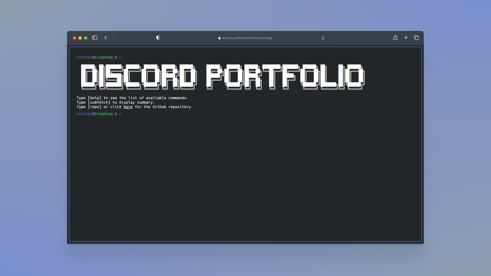
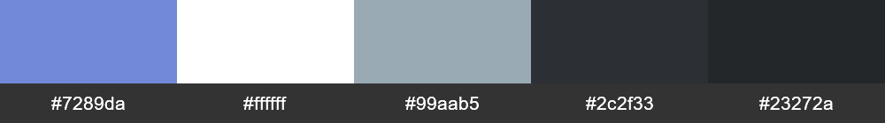

<div align="center">

<h1>Discord-Portofolio-Terminal</h1>

<h6>A Terminal Style Portofolio Wbsite Template with Discord Theme</h6>

<a href="https://discord-portofolio-terminal.vercel.app/" _target="blank">

</a>

[](https://discord-portofolio-terminal.vercel.app/)



<p>Discord Color Palette</p>

</div>


## 🚀 Set-up

Discord-Portfolio-Terminal requires the `yarn` package manager. You can install `yarn` [here](https://classic.yarnpkg.com/lang/en/docs/install/).

Clone this repository to a location of your choosing

```bash
git clone https://github.com/Sang-Buster/Discord-Portfolio-Terminal.git && cd Discord-Portofolio-Terminal
```

Then install dependencies and start developing there:

```bash
yarn install && yarn dev
```

### Docker Usage

First, clone the project and edit `config.json` to your liking. Then run the following to start the container in the background:

```shell
docker-compose up -d
```

If you **know** what you were doing, you can also try changing `Dockerfile` & `docker-compose.yml`!
Learn more about Docker [here](https://docs.docker.com/get-started/overview/ 'here').

## 📄 Configuration

### Basic Configuration

90% of Discord-Portfolio-Terminal's configurations are done through the `config.json` file.

```javascript
{
  "readmeUrl": // create a Github README and link it here!
  "title": // title of the website
  "name": // your name, included in 'about' command
  "ascii": // ascii art to display
  "social": {
    "github": // your handle
    "linkedin": // your handle
  },
  "email": // your email
  "ps1_hostname": "SingSong" // hostname in prompt
  "ps1_username": "visitor", // username in prompt
  "resume_url": "../resume.pdf", // path to your resume
  "non_terminal_url": "W",
  "colors": {
    "light": {
      ...
    },
    "dark": {
      ... // you can use existing templates in themes.json or use your own!
    }
  }
}
```

Feel free to change it as you see fit!

### Themes

You can find several pre-configured themes in `themes.json`, and you can replace the colors in `config.json` with the theme color you like! The themes are based on the themes on [this website](https://glitchbone.github.io/vscode-base16-term/#/).

For a better preview of the themes, checkout the images in the `demo` folder.

### Favicons

Favicons are located in `public/`, along with the other files you may want to upload to your website. I used this [website](https://www.favicon-generator.org/) to generate favicons.

### Banner

You may also want to change the output of the `banner` command. To do that, simply paste your generated banner in `src/utils/bin/commands.ts`. I used this [website](https://manytools.org/hacker-tools/ascii-banner/) to generate my banner.

### Advanced Configuration

If you want to further customize your page, feel free to change the source code to your liking!

## 🌐 Deploy on Vercel

The easiest way to deploy a Next.js app is to use the [Vercel Platform](https://vercel.com/) from the creators of Next.js.

You can install `vercel` cli and follow the instruction [here](https://vercel.com/docs/concepts/deployments/overview).

You can also connect your github account to vercel and have vercel automatically deploy the github repository for you.

## Credit

Based on M4TT72's [Terminal](https://github.com/m4tt72/terminal) and Cveinnt's [LiveTerm](https://github.com/Cveinnt/LiveTerm)
